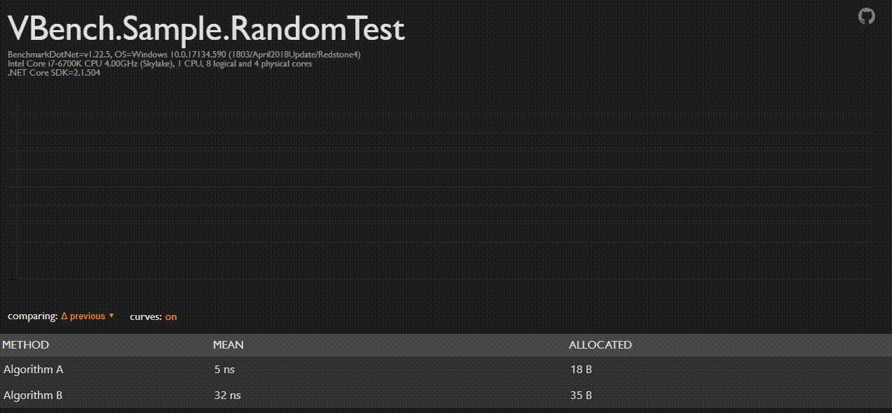

# VBench

[](https://www.nuget.org/packages/VBench/)

## The Problem
You are using [BenchmarkDotNet](https://github.com/dotnet/BenchmarkDotNet) to measure your project's performance. In addition, you also want to keep track of the project's performance over time however, [BenchmarkDotNet](https://github.com/dotnet/BenchmarkDotNet) do not have an exporter/report to track said changes.

## The Solution
**VBench** is a netstandard library that contains a `BenchmarkDotNet.Exporter.IExporter` that will enable you to track and compare, past and present benchmark reports via a nice visual html report.

### Usage

Once you have added the [nuget](https://www.nuget.org/packages/Acklann.VBench/) package to your project. Add a new instance of the `TimelineExporter` class as shown below.

```csharp
using Acklann.VBench;
using BenchmarkDotNet.Configs;
using BenchmarkDotNet.Jobs;
using BenchmarkDotNet.Running;

namespace VBench.Sample
{
    internal class Program
    {
        private static void Main(string[] args)
        {
            BenchmarkSwitcher.FromAssembly(typeof(Program).Assembly).Run(args, DefaultConfig.Instance
                .With(new TimelineExporter()));
        }
    }
}
```

When you run your benchmarks two new files (`vbench.html` and `vbench.litedb`) will be added to the `BenchmarkDotNet.Artifacts\results` folder. All past and present results will be stored in`vbench.litedb` while `vbench.html` will present it's contents. Check out the example below.



